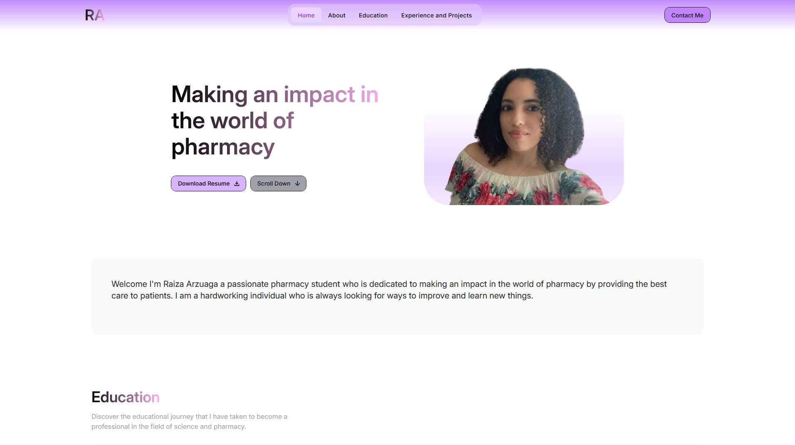

# Pharmacy-Portfolio-Website 🏥💊

A personal portfolio website for a pharmacy student to showcase their knowledge, projects, and experience in the field of pharmacy and healthcare. This website serves as a professional online presence, highlighting academic achievements, research, and contributions to the pharmaceutical industry.

## 🚀 Features
- ✅ About Me – Introduction and background in pharmacy
- ✅ Education & Certifications – Academic journey and qualifications
- ✅ Research & Projects – Showcase of case studies, pharmaceutical research, and academic projects
- ✅ Skills & Expertise – Areas of specialization in pharmacy, medicine, and healthcare
- ✅ Contact Information – Easy way for recruiters, professors, or professionals to get in touch

## 🛠️ Technologies Used
- Frontend: React with HTML, CSS and JavaScript 
- Styling: TailwindCSS for a clean and modern look
- Hosting: Netlify 

📸 Website Image

🔗 **Website Link**
[View Portfolio](https://rarzuagaportfolio.netlify.app/)

